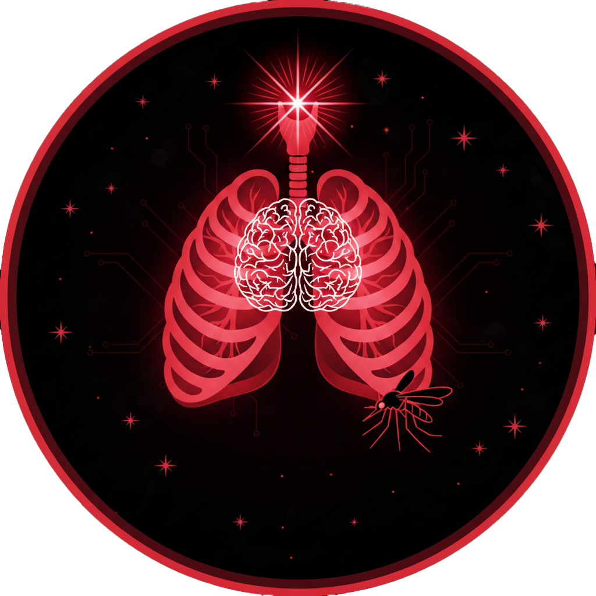

# Healthiligence - AI Health Analyzer

An advanced AI-powered health prediction web application that uses machine learning to predict the possibility of various diseases including diabetes, kidney disease, liver disease, malaria, and pneumonia.



## 🌟 Features

- **Multiple Disease Predictions**
  - Diabetes prediction based on health metrics
  - Kidney disease detection
  - Liver disease assessment
  - Malaria detection from blood cell images
  - Pneumonia detection from chest X-rays

- **Modern UI/UX**
  - Futuristic design with smooth animations
  - Dark/Light mode support
  - Responsive design for all devices
  - Intuitive navigation and user flow

- **Advanced ML Models**
  - Random Forest classifiers for numerical predictions
  - CNN models for image-based detection
  - High accuracy rates with confidence scores
  - Real-time prediction results

- **User Management**
  - Secure authentication system
  - Personalized dashboard
  - Model retraining capabilities

## 🚀 Tech Stack

### Frontend
- **Next.js 14** - React framework for production
- **TypeScript** - Type-safe code
- **Tailwind CSS** - Utility-first CSS framework
- **Framer Motion** - Animation library
- **Zustand** - State management
- **React Dropzone** - File upload handling

### Backend
- **Python 3.9+** - Core language
- **Flask** - API server
- **TensorFlow/Keras** - Deep learning models
- **scikit-learn** - Machine learning algorithms
- **Pandas/NumPy** - Data processing

## 📋 Prerequisites

- Node.js 18+ and npm/yarn
- Python 3.9+
- pip (Python package manager)
- Kaggle account (for downloading datasets)

## 🛠️ Installation

### 1. Clone the Repository

```bash
git clone <repository-url>
cd MedX
```

### 2. Install Frontend Dependencies

```bash
npm install
# or
yarn install
```

### 3. Install Backend Dependencies

```bash
cd backend
pip install -r requirements.txt
```

### 4. Download Datasets

You need to download the following datasets from Kaggle and place them in the `backend/datasets/` directory:

1. **Diabetes Dataset**
   - URL: https://www.kaggle.com/datasets/uciml/pima-indians-diabetes-database
   - Save as: `backend/datasets/diabetes.csv`

2. **Kidney Disease Dataset**
   - URL: https://www.kaggle.com/datasets/mansoordaku/ckdisease
   - Save as: `backend/datasets/kidney_disease.csv`

3. **Liver Disease Dataset**
   - URL: https://www.kaggle.com/datasets/uciml/indian-liver-patient-records
   - Save as: `backend/datasets/indian_liver_patient.csv`

4. **Malaria Dataset**
   - URL: https://www.kaggle.com/datasets/iarunava/cell-images-for-detecting-malaria
   - Extract to: `backend/datasets/cell_images/`

5. **Pneumonia Dataset**
   - URL: https://www.kaggle.com/datasets/paultimothymooney/chest-xray-pneumonia
   - Extract to: `backend/datasets/chest_xray/`

**Using Kaggle CLI:**

```bash
# Install Kaggle CLI
pip install kaggle

# Set up API credentials (https://github.com/Kaggle/kaggle-api#api-credentials)

# Download datasets
kaggle datasets download -d uciml/pima-indians-diabetes-database -p backend/datasets --unzip
kaggle datasets download -d mansoordaku/ckdisease -p backend/datasets --unzip
kaggle datasets download -d uciml/indian-liver-patient-records -p backend/datasets --unzip
kaggle datasets download -d iarunava/cell-images-for-detecting-malaria -p backend/datasets --unzip
kaggle datasets download -d paultimothymooney/chest-xray-pneumonia -p backend/datasets --unzip
```

### 5. Train Models

**Train numerical models (Diabetes, Kidney, Liver):**
```bash
cd backend
python train_models.py
```

**Train image models (Malaria, Pneumonia):**
```bash
python train_image_models.py
```

### 6. Configure Environment

Create `.env.local` file in the root directory:

```env
NEXT_PUBLIC_API_URL=http://localhost:5000
```

## 🏃 Running the Application

### Start Backend API Server

```bash
cd backend
python api_server.py
```

The API server will start on `http://localhost:5000`

### Start Frontend Development Server

In a new terminal:

```bash
npm run dev
# or
yarn dev
```

The application will be available at `http://localhost:3000`

## 📱 Usage

1. **Sign In/Sign Up**
   - Create an account or sign in with existing credentials
   - Demo authentication accepts any username/password

2. **Home Page**
   - View all available models and their accuracies
   - Click "Start Prediction" to choose a model
   - Navigate through the app using the top navigation bar

3. **Making Predictions**
   
   **For Numerical Models (Diabetes, Kidney, Liver):**
   - Fill in the required health metrics
   - Click "Predict" button
   - View results with confidence scores and probabilities

   **For Image Models (Malaria, Pneumonia):**
   - Drag and drop or select an image file
   - Click "Predict" button
   - View detection results with the analyzed image

4. **Settings**
   - Retrain models with updated datasets
   - View model information and accuracy metrics

5. **Dark/Light Mode**
   - Toggle between dark and light themes using the button in the navigation bar

## 🎨 Color Scheme

- **Dark Mode**: Red and black shades
- **Light Mode**: Red and white shades
- **Accent**: Primary red gradient (#dc2626 to #b91c1c)

## 📊 Model Information

### Diabetes Model
- **Algorithm**: Random Forest Classifier
- **Features**: 8 health metrics (Pregnancies, Glucose, Blood Pressure, etc.)
- **Dataset**: Pima Indians Diabetes Database

### Kidney Disease Model
- **Algorithm**: Random Forest Classifier
- **Features**: 24 clinical parameters
- **Dataset**: Chronic Kidney Disease dataset

### Liver Disease Model
- **Algorithm**: Random Forest Classifier
- **Features**: 10 liver function tests
- **Dataset**: Indian Liver Patient Records

### Malaria Detection Model
- **Algorithm**: Convolutional Neural Network (CNN)
- **Input**: Blood cell images (128x128 RGB)
- **Dataset**: Cell Images for Detecting Malaria

### Pneumonia Detection Model
- **Algorithm**: Convolutional Neural Network (CNN)
- **Input**: Chest X-ray images (128x128 RGB)
- **Dataset**: Chest X-Ray Images (Pneumonia)

## 🔒 Security Note

The current authentication system is for demonstration purposes. In production:
- Implement proper user authentication with hashed passwords
- Use JWT tokens or session management
- Add HTTPS encryption
- Implement rate limiting
- Add CORS configuration

## ⚠️ Disclaimer

This application is designed for educational and research purposes. The predictions should not be used as a substitute for professional medical advice, diagnosis, or treatment. Always consult with qualified healthcare professionals for medical concerns.

## 👨‍💻 Project Maker

**Benison Binoy**
- Registration Number: 2262044
- Final Year Project - 2026
- Computer Science & Engineering

## 📝 License

This project is part of an academic final year project.

## 🤝 Contributing

This is an academic project. For suggestions or issues, please contact the project maker.

## 📞 Support

For any questions or support, please refer to the documentation or contact the project maker.

---

Built with ❤️ using Next.js, Python, and Machine Learning
